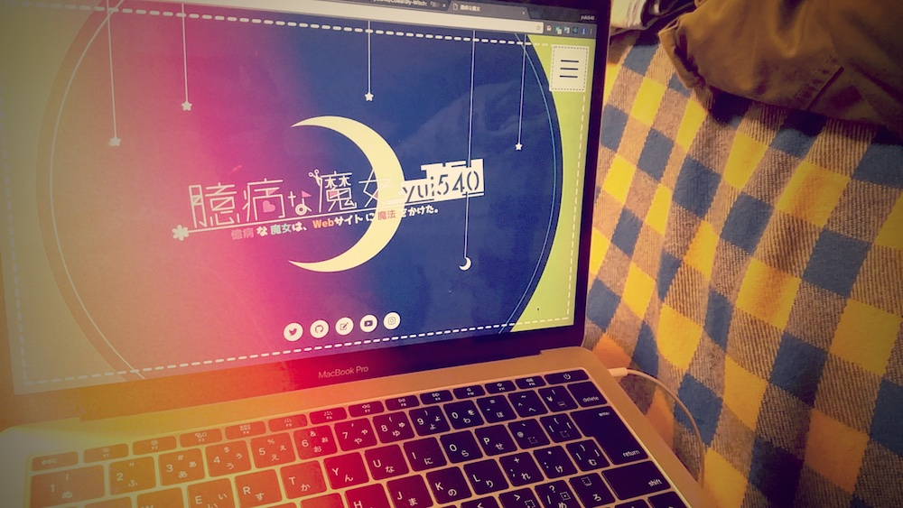
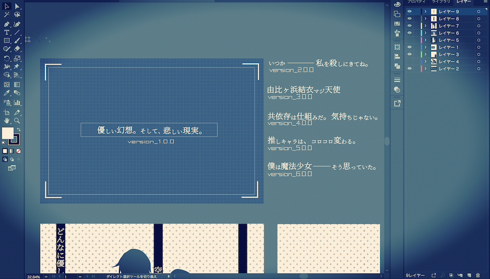
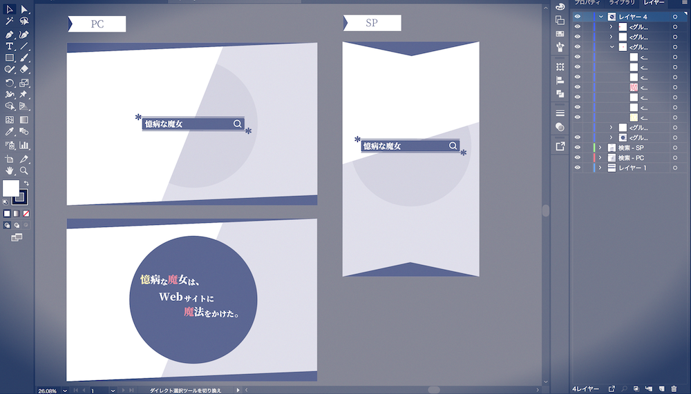
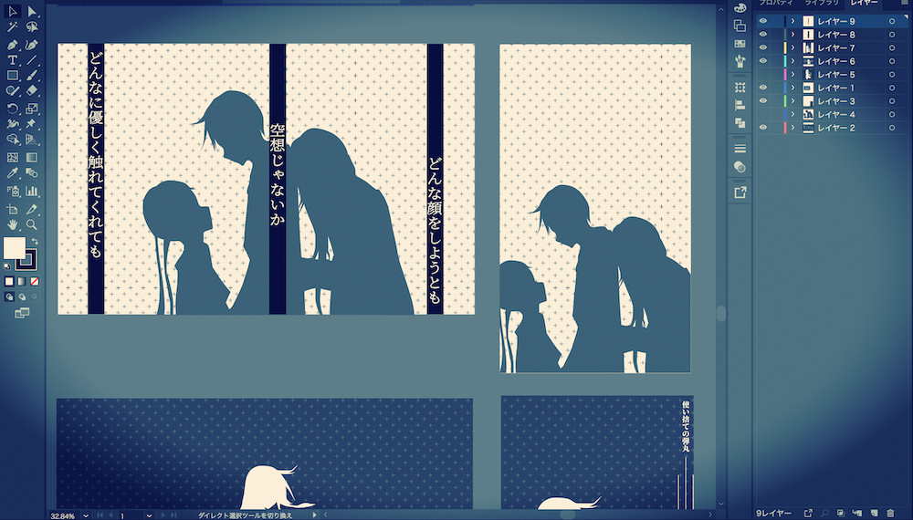
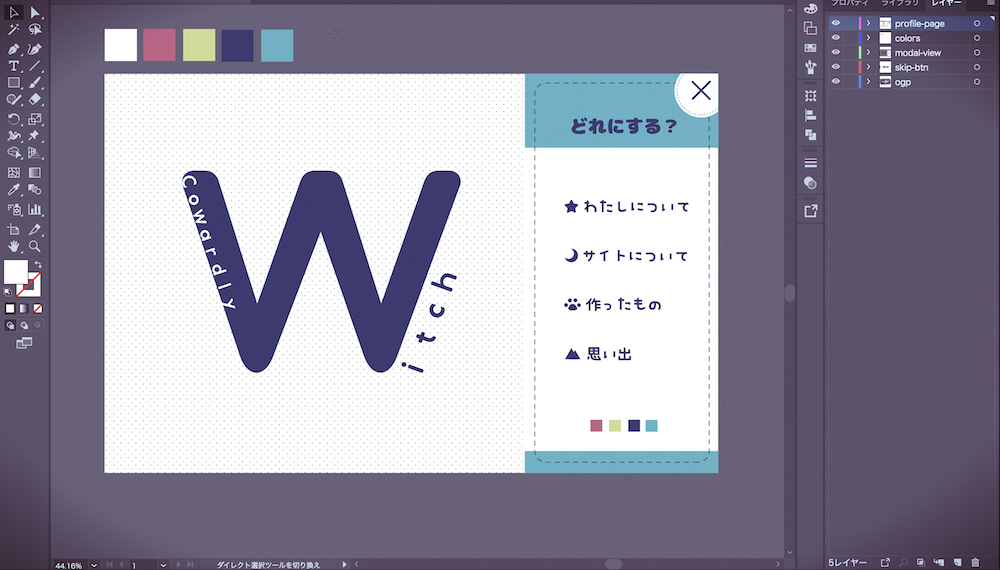

# 臆病な魔女
yui540.portfolio.version7

数々のリニューアルを経て、僕は新しい試みのプロジェクトに取り掛かりました。

-------それが、Cowardly Witch Projectです。

🎉 [yui540.graphics](https://yui540.graphics) 🎉

このプロジェクトで重要なのが、Webサイトやアプリケーションを「魔法の世界」や「おとぎ話」のような世界観で表現することです。

それには、アニメーションやデザインの感性を重要視する必要があり、まず最初にそれを活かしたWebサイトを制作する必要がありました。

そこで完成したのが、このサイト「臆病な魔女」です。

- デザイン・モーション・コーディング
  - yui540
  - [Twitter - @yui540](https://twitter.com/yui540)

## 臆病な魔女とは
このサイトのテーマである「臆病な魔女」とは、魔女になりたいという気持ちと、僕自身の臆病な性格が混ざり合って出来た僕自身の属性です。 

なので、「yui540=臆病な魔女」です。

そんな臆病な魔女がWebサイトに感情を持たせたいという思いから、このサイトに魔法をかけました。

「臆病な魔女は、Webサイトに魔法をかけた。」

## オープニングアニメーションの構成
このサイトのオープニングアニメーションは、

- Prologue
- Version_1
- Version_2
- Version_3
- Version_4
- Version_5
- Version_6
- LastChapter

というパート構成になっています。

Prologueは、「魔女にとっての検索サイトってどんなのだろう？」ということをイメージして、自分なりに魔女風の検索を表現しました。

過去バージョンは、「作ったものページ」にありますのでよかったらご覧ください。

※Version_1 ~ Version_4は現在、非公開のため動画での公開になっています。

## 各ページ
各ページのデザインやアニメーションは、とにかく僕が思う「可愛い」を目一杯表現しました。

全体的にカラフルな色合いに仕上がったと思います。

## さいごに
これからも、このサイトのような「魔法の世界」や「おとぎ話」のような世界観のWebサイトやアプリケーションを作っていきます。

ぜひお楽しみ。
